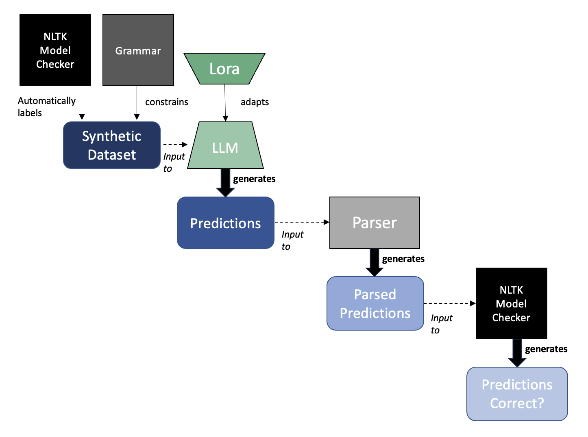
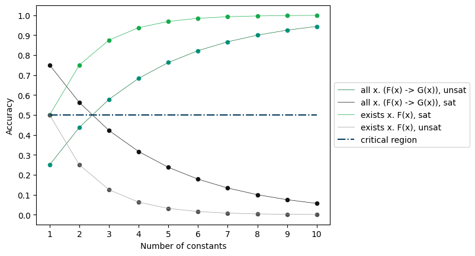

<!-- Improved compatibility of back to top link: See: https://github.com/othneildrew/Best-README-Template/pull/73 -->
<a name="readme-top"></a>


<!-- PROJECT SHIELDS -->
<!--
*** I'm using markdown "reference style" links for readability.
*** Reference links are enclosed in brackets [ ] instead of parentheses ( ).
*** See the bottom of this document for the declaration of the reference variables
*** for contributors-url, forks-url, etc. This is an optional, concise syntax you may use.
*** https://www.markdownguide.org/basic-syntax/#reference-style-links

[![Contributors][contributors-shield]][contributors-url]
[![Forks][forks-shield]][forks-url]
[![Stargazers][stars-shield]][stars-url]
[![Issues][issues-shield]][issues-url]
[![MIT License][license-shield]][license-url]
[![LinkedIn][linkedin-shield]][linkedin-url]
-->


<!-- PROJECT LOGO -->
<br />
<div align="center">

<h3 align="center">Teaching LLMs Readoning in Predicate Logic</h3>

  <p align="center">
    Master Thesis in NLP.
    <br />
    <a href="https://github.com/simondoebele/llm-predicate-logic"><strong>Explore the docs »</strong></a>
    <br />
    <br />
    <a href="https://github.com/simondoebele/llm-predicate-logic/issues">Report Bug</a>
    ·
    <a href="https://github.com/simondoebele/llm-predicate-logic/issues">Request Feature</a>
  </p>
</div>


<!-- TABLE OF CONTENTS -->
<details>
  <summary>Table of Contents</summary>
  <ol>
    <li>
      <a href="#about-the-project">About The Project</a>
    </li>
    <li>
      <a href="#getting-started">Getting Started</a>
      <ul>
        <li><a href="#prerequisites">Prerequisites</a></li>
        <li><a href="#usage">Usage</a></li>
        <li><a href="#structure">Repository Structure</a></li>
      </ul>
    </li>
    <li><a href="#contributing">Contributing</a></li>
    <!-- <li><a href="#acknowledgments">Acknowledgments</a></li> -->
  </ol>
</details>


<!-- ABOUT THE PROJECT -->
## About The Project

This is my master thesis project, supervised by Prof. Dr. Jan Niehues and Prof. Dr. Gregor Betz, both from the Karlsruhe Institute of Technology. It is about teaching different large language models (LLMs) how to reason using first-order (predicate) logic. Here is the abstract:

Large language models (LLMs), such as GPT-3 and more recently Llama-2, have achieved ever more impressive results on many natural language understanding tasks. Benchmarks such as BIG Bench hard needed to exclude certain tasks, because LLMs have managed to perform so well on them. Finding ever more challenging reasoning tasks for LLMs has been of much interest. On the other hand, LLMs still make silly reasoning mistakes or hallucinate, that is, make false claims as if they were true. Alleviating these mistakes and halluci- nations has equally been of much interest. That is why, in this thesis, we aim to teach LLMs to emulate reasoning in first-order (predicate) logic.

In order to address this challenge, we design and build a first-of-its-kind synthetic dataset that we call the "Synthetic Predicate Logic Corpus" (or SPLC), which includes three tasks in reasoning using both natural language and the artificial language of predicate logic. By making use of a model checker, we can automatically generate the labels; and by building (or modifying) semantic parsers, we can map between natural language and the language of logic. Besides automatic labeling, the big advantage of our dataset is that we can also adjust its difficulty. We produce a baseline that we compare our models’ performance to.



In over 150 experiments, we show the first empirical demonstration that the Falcon, Llama, Orca, and Wizard LLMs can emulate logical reasoning in first-order logic when using LoRA adapters. We find that they are only able to generalize to more difficult tasks to a small extent, although scaling is not robust.

You can find out more in the attached thesis document. 
I highly encourage you to read it, especially, if you are interested in synthetic datasets, their potential pitfalls, and how to create robust synthetic datasets (something at which I hint in the following graph):




<p align="right">(<a href="#readme-top">back to top</a>)</p>


<!-- GETTING STARTED -->
## Getting Started

### Prerequisites

```
pip install -r requirements.txt
```


<!-- USAGE EXAMPLES -->
### Usage

This project is not distributed here in its final form, as it is work in progress that might be published (so the latest stage of insights will only enter here with some delay). Hence, in order to work with this project, here are some general guidelines:

The general pipeline is:
* (1) Dataset creation (see file Predicate_Logic_Dataset.py)
* (2) Possibly: Finetuning (see respective folder)
* (3) Evaluation (see respective folder)
* (4) Post-analyses (see notebooks folder)

Next, for the python files, some shell scripts are missing (but since those were specific to the Workload manager  used at , you would have to rewrite them anyway).

For the notebooks, you could e.g. use

   ```sh
   jupyter lab
   ```

or

   ```sh
   jupyter notebook
   ```

to launch the notebooks.

For more information, see [here](https://jupyter.org/install).

<p align="right">(<a href="#readme-top">back to top</a>)</p>


<!-- Repository Structure -->
### Repository structure

- Predicate_Logic_Dataset.py: is used to create the synthetic dataset
- evaluate_tasks.py: is used to evaluate parsed LLM outputs, makes use of:
- Parser.py: is used in evaluation to parse LLM outputs
- timeout.py is a utility file used for labeling the dataset
- Folders:
  - notebooks: 
    - Dataset creation: converts the synthetic dataset that is created in Predicate_Logic_Dataset.py into Prompt-based Datasets for finetuning.
    - Fewshot creation: converts the synthetic dataset that is created in Predicate_Logic_Dataset.py into Prompt-based Datasets for fewshot evaluation.
    - TrainTestSetCreation: build datasets for finetuning.
    - Baseline: the baselines are created here
    - Descriptive Statistics: here, we look for imbalances in our synthetic datasets.
    - Zeroshot evaluation: evaluation of zeroshot learning
    - Fewshot evaluation: evaluation of fewshot learning
    - Training evaluation: evaluation of finetuning
    - Qualitative Analyses: inspecting data points to judge output quality
    - Quantitative Analyses: inspecting what makes the predicate logic tasks hard (so as to build harder and harder datasets)
    - Test Parser: tests the parser
  - finetuning: perform supervised finetuning of the LLMs in many different settings (different predicate logic tasks, task-combinations, different hyperparameters, ...)
  - evaluation: evaluate LLMs via zeroshot learning, fewshot learning and after finetuning


<p align="right">(<a href="#readme-top">back to top</a>)</p>


<!-- CONTRIBUTING -->
## Contributing

If you have a suggestion that would make this better, please fork the repo and create a pull request. You can also simply open an issue with the tag "enhancement".
Don't forget to give the project a star! Thanks again!

1. Fork the Project
2. Create your Feature Branch (`git checkout -b feature/AmazingFeature`)
3. Commit your Changes (`git commit -m 'Add some AmazingFeature'`)
4. Push to the Branch (`git push origin feature/AmazingFeature`)
5. Open a Pull Request

<p align="right">(<a href="#readme-top">back to top</a>)</p>


<!-- ACKNOWLEDGMENTS -->
## Acknowledgments

The authors acknowledge support by the state of Baden-Württemberg through bwHPC. Especially the use of the latest NVidia GPUs, which enabled me to work with state of the art LLMs.


<p align="right">(<a href="#readme-top">back to top</a>)</p>


<!-- MARKDOWN LINKS & IMAGES -->
<!-- https://www.markdownguide.org/basic-syntax/#reference-style-links -->
[contributors-shield]: https://img.shields.io/github/contributors/github_username/repo_name.svg?style=for-the-badge
[contributors-url]: https://github.com/github_username/repo_name/graphs/contributors
[forks-shield]: https://img.shields.io/github/forks/github_username/repo_name.svg?style=for-the-badge
[forks-url]: https://github.com/github_username/repo_name/network/members
[stars-shield]: https://img.shields.io/github/stars/github_username/repo_name.svg?style=for-the-badge
[stars-url]: https://github.com/github_username/repo_name/stargazers
[issues-shield]: https://img.shields.io/github/issues/github_username/repo_name.svg?style=for-the-badge
[issues-url]: https://github.com/github_username/repo_name/issues
[license-shield]: https://img.shields.io/github/license/github_username/repo_name.svg?style=for-the-badge
[license-url]: https://github.com/github_username/repo_name/blob/master/LICENSE.txt
[linkedin-shield]: https://img.shields.io/badge/-LinkedIn-black.svg?style=for-the-badge&logo=linkedin&colorB=555
[linkedin-url]: https://linkedin.com/in/linkedin_username
[product-screenshot]: images/screenshot.png
[Next.js]: https://img.shields.io/badge/next.js-000000?style=for-the-badge&logo=nextdotjs&logoColor=white
[Next-url]: https://nextjs.org/
[React.js]: https://img.shields.io/badge/React-20232A?style=for-the-badge&logo=react&logoColor=61DAFB
[React-url]: https://reactjs.org/
[Vue.js]: https://img.shields.io/badge/Vue.js-35495E?style=for-the-badge&logo=vuedotjs&logoColor=4FC08D
[Vue-url]: https://vuejs.org/
[Angular.io]: https://img.shields.io/badge/Angular-DD0031?style=for-the-badge&logo=angular&logoColor=white
[Angular-url]: https://angular.io/
[Svelte.dev]: https://img.shields.io/badge/Svelte-4A4A55?style=for-the-badge&logo=svelte&logoColor=FF3E00
[Svelte-url]: https://svelte.dev/
[Laravel.com]: https://img.shields.io/badge/Laravel-FF2D20?style=for-the-badge&logo=laravel&logoColor=white
[Laravel-url]: https://laravel.com
[Bootstrap.com]: https://img.shields.io/badge/Bootstrap-563D7C?style=for-the-badge&logo=bootstrap&logoColor=white
[Bootstrap-url]: https://getbootstrap.com
[JQuery.com]: https://img.shields.io/badge/jQuery-0769AD?style=for-the-badge&logo=jquery&logoColor=white
[JQuery-url]: https://jquery.com 
